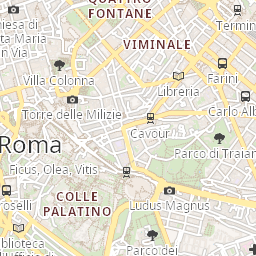
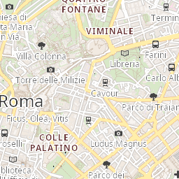

# PBFMapRenderer

A **Delphi VCL** library that reads **MVT / PBF vector tiles** from an **MBTiles** database and renders
them to a `TCanvas` using a **Mapbox GL / MapTiler `style.json`** — full paint/layout model, expression
engine, sprites and a MapLibre-style label-placement engine. Output is anti-aliased and pluggable between
a **GDI+** and a **Skia** backend.

- **Target:** Delphi 10.3 Rio or later · VCL · FireDAC (SQLite **statically linked** — no `sqlite3.dll`)
- **Dependencies:** none required (Skia is optional and opt-in)
- **License:** MIT

| GDI+ backend | Skia backend |
|:---:|:---:|
|  |  |

<sub>Same renderer, two backends — Rome, z14. Switch at runtime with `Engine.UseSkia`.</sub>

---

## Highlights

- **MBTiles → bitmap** in one call: decode (gzip/zlib), parse MVT, apply the style, paint a tile.
- **Mapbox GL style support**: paint + layout for background / fill / line / circle / symbol layers,
  the expression engine (`get`, `case`, `match`, `step`, `interpolate` incl. `-hcl`/`-lab`, cubic-bezier,
  math, …), legacy function-stops and filters.
- **Pluggable drawing backend** — `TPBFDrawSurface` (GDI+ base) / `TPBFSkiaSurface` (Skia subclass).
  Runtime switch via `Engine.UseSkia`; the renderer has no backend conditionals; adding a backend
  (e.g. Direct2D) is just another subclass.
- **Label engine** (MapLibre-style): collision grid, dedup, variable-anchor, text/icon-optional,
  text-along-line, halo, sprites.
- **Built for throughput**: zero-copy MVT decode, per-`class` feature index, filter-elision, per-thread
  property memoisation, decoded-tile + metatile-slice LRU caches.
- **Self-contained**: no external runtime dependency; optional `OnLog` callback.

---

## Requirements

| | |
|---|---|
| Compiler | Delphi 10.3 Rio+ (RAD Studio), VCL |
| Data | FireDAC (bundled). SQLite is statically linked (`FireDAC.Phys.SQLiteWrapper.Stat`) — no `sqlite3.dll` |
| Drawing | GDI+ (`Winapi.GDIPOBJ`) always; **Skia** only if you link `PBFMap.Render.Surface.Skia` (ships `sk4d.dll`) |

## Installation

Add `Source\` to your project's unit search path. The library has no `.dproj` — you compile its units
directly. To enable the Skia backend, add `PBFMap.Render.Surface.Skia` to your project's `uses`
(its `initialization` registers the backend) and deploy `sk4d.dll` next to the executable.

---

## Quick start

```pascal
uses PBFMap.Engine;

var
  Engine: TPBFMapEngine;
begin
  Engine := TPBFMapEngine.Create(256);          // 256 px output tiles
  try
    Engine.OpenTiles('data\roma.mbtiles');
    Engine.LoadStyle('style.json');             // also loads sprite.json/.png from that folder
    Engine.RenderTile(14, 8760, 6088, Image1.Picture.Bitmap.Canvas);
  finally
    Engine.Free;
  end;
end;
```

## Usage examples

**Render to a stand-alone bitmap**

```pascal
var Bmp := TBitmap.Create;
try
  Bmp.PixelFormat := pf32bit;
  Bmp.SetSize(256, 256);
  Engine.RenderTile(AZoom, AX, AY, Bmp.Canvas);
  Bmp.SaveToFile('tile.bmp');
finally
  Bmp.Free;
end;
```

**Switch to the Skia backend at runtime** (requires `PBFMap.Render.Surface.Skia` linked + `sk4d.dll`)

```pascal
Engine.UseSkia := True;     // geometry, text (real stroke halo) and icons via Skia
```

**Multi-threaded rendering** — one engine per thread, parse the style once and share it (read-only):

```pascal
SharedStyle  := ...;        // parsed once
SharedSprite := ...;
// on each worker thread:
WorkerEngine := TPBFMapEngine.Create(256);
WorkerEngine.OpenTiles(MBTilesPath);              // FireDAC is thread-affine -> per-thread engine
WorkerEngine.SetSharedStyle(SharedStyle, SharedSprite);
WorkerEngine.RenderTile(z, x, y, Canvas);
```

> `TPBFMapEngine` is **not** thread-safe — use one instance per thread. The shared style holds no mutable
> per-render state, so it is safe to share across worker engines.

**Graceful errors via a log callback** — when `OnLog` is set, malformed tiles/layers are logged and skipped
instead of raising:

```pascal
Engine.OnLog :=
  procedure(const aFunc, aDesc: string; aLevel: TPBFLogLevel; aIsDebug: Boolean)
  begin
    MyLogger.Write(aFunc, aDesc, Ord(aLevel) - 1);   // levels: Exception=1 … Timing=5
  end;
```

### Configuration (`TPBFMapEngine`)

| Property | Default | Effect |
|----------|:---:|--------|
| `UseSkia` | False | Skia drawing backend (needs the Skia unit linked) |
| `Supersample` | 2 | SSAA factor (render N×, downscale); 1 = off |
| `Antialias` | True | GDI+ geometry anti-aliasing |
| `SyntheticCasing` | True | Grey under-stroke for light lines — set **False** for styles with real casing (osm-bright) |
| `MetatileSize` | 2 | Render an N×N block as one scene so labels stitch across tile edges; slices cached |
| `TileCacheSize` | 64 | LRU of decoded tiles |
| `OnLog` | nil | `TPBFLogEvent`; log + degrade instead of raising |

---

## Performance

Measured single-thread, profiling off, on a **dense Rome z14 urban tile** (~4 700 roads, full osm-bright
style) — a worst-case tile; rural / lower-zoom tiles are much faster. (`Test\bench.dpr`.)

| Configuration | first paint | cached re-paint | tiles/s |
|---------------|:---:|:---:|:---:|
| SS2 + AA (highest quality) | ~130 ms/tile | ~103 ms | ~8–10 |
| SS1 + AA (typical) | ~105 ms/tile | ~64 ms | ~10–15 |
| SS1, no-AA (fastest) | ~88 ms/tile | ~64 ms | ~11–16 |
| Metatile (2×2) | ~124 ms 1st paint | **~0 ms** | re-paint is **instant** (slice cache) |

- **Skia backend** is ~1.3× faster end-to-end and lower-memory; per primitive (`Test\surfbench.dpr`):
  fills **4.5×**, dashed lines **1.9×**, circles 2.2×, solid lines 1.5×.
- **Multi-threaded**: engines are independent — a 4-thread pool reaches **~30–50 tiles/s** for first paint;
  cached tiles re-paint instantly.
- Decode + filter alone is ~31 ms/tile and is backend-independent (the CPU floor); the rest is rasterisation.

### Is it fast enough for interactive pan / zoom?

Yes in practice, with one caveat. Rendered tiles are **cached**, so panning/zooming over already-seen areas
is **instant** (the host map control just blits cached bitmaps). During a pan only the few new tiles at the
leading edge need rendering, and that happens **off the UI thread** (a worker pool) while the control shows
the scaled parent tile in the meantime — the UI never blocks. The only visible latency is the **first reveal
of brand-new areas**: a full fresh screen (~40 tiles at 256 px) streams in over roughly **1–2 s** at full
quality. For truly instant fresh-screen fills, prefetch tiles around the viewport, enlarge the pool, or use a
GPU backend.

### Versus other renderers

PBFMapRenderer is a **CPU raster** renderer (it draws to a bitmap). Its performance class is that of
**Mapnik** — the C++ CPU rasteriser behind most OSM tile servers — i.e. tens of milliseconds per dense
256 px tile, single-thread; PBFMapRenderer is in the same order of magnitude, in pure Delphi. **GPU**
renderers (MapLibre GL Native, Mapbox GL) render an order of magnitude more tiles per second but target
real-time client GPU rendering — a different domain from rendering tiles to a VCL canvas for an offline app.

---

## Architecture (`Source\`)

```
MBTiles → Decompress → MVT.Parser → TMVTTile ┐
                          style.json → TMGLStyle ┼→ TMGLRenderer → TPBFDrawSurface → TCanvas
                                                 ┘                  (GDI+ | Skia)
```

| Unit | Role |
|------|------|
| `PBFMap.Decoder` / `PBFMap.Compression` | protobuf reader (zero-copy) / gzip-zlib-raw |
| `PBFMap.MVT.Parser` / `PBFMap.MVT.Types` | PBF → `TMVTTile`; features, geometry, typed values |
| `PBFMap.Color` / `PBFMap.Expressions` | colour parsing; Mapbox GL expression AST + filters |
| `PBFMap.Style.Model` / `PBFMap.Style.Parser` | `style.json` → paint/layout property bags |
| `PBFMap.Collision` / `PBFMap.Sprite` | symbol collision grid; sprite atlas |
| `PBFMap.Render.Surface` (+ `.Skia`) | drawing backend abstraction (GDI+ base / Skia subclass) |
| `PBFMap.Renderer.GL` / `PBFMap.Engine` | style-driven paint + placement; `TPBFMapEngine` facade |
| `PBFMap.Profile` | opt-in per-function profiler (zero-cost when off) |

---

## Limitations

- **Text** uses platform/Skia fonts, **not SDF glyph atlases** — no per-glyph curved text along sharp curves.
- **`fill-extrusion`** (3D buildings) is drawn as a flat footprint; no `raster`, `heatmap`, `hillshade`,
  `sky` layers.
- **No multi-tile pan/zoom or tile server** built in — the library renders one tile (or one metatile block);
  the host application owns the viewport, caching and panning.
- **Unsupported expressions**: `feature-state`, `within`, `distance`, rich `format` / `number-format`,
  `collator`. `text-halo-blur` is approximated; `*-pitch-*` / `*-rotation-alignment` are read but no-ops on
  flat north-up tiles.
- `TPBFMapEngine` is **not thread-safe** (use one per thread).
- Best-effort `line-pattern` (sprite stamping along the line).

---

## Building & testing

No `.dproj` for the library. `Test\build_test.bat` wraps `rsvars` + `dcc32` with the right namespaces:

```sh
# from Test\
build_test.bat PBFMapRenderer.Tests.dpr  &&  PBFMapRenderer.Tests.exe   # DUnitX suite (94 tests)
build_test.bat skiaab.dpr                &&  skiaab.exe                  # GDI vs Skia A/B parity gate
build_test.bat bench.dpr                 &&  bench.exe                   # 7×7 z14 grid timings
build_test.bat surfbench.dpr             &&  surfbench.exe               # per-primitive GDI vs Skia
```

Integration tests need `Sample\BasicViewer\style.json` + `Sample\BasicViewer\data\roma.mbtiles`
(found by walking up from the exe). Rome test tile = z14 `8760/6088`. `skiaab.exe` is a **regression gate**
(non-zero exit if the Skia↔GDI+ pixel delta exceeds tolerance).

---

## License

MIT — see [LICENSE](LICENSE). © 2025 amancini.
